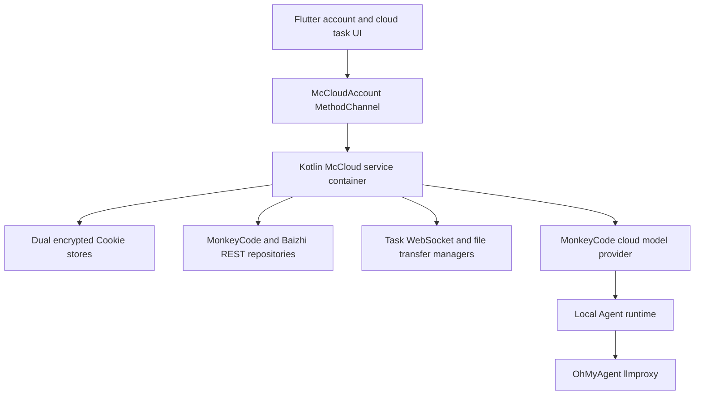

# Architecture

## MonkeyCode Cloud Integration

The Android process owns MonkeyCode Cloud networking and credentials. Flutter only receives sanitized domain payloads through platform channels.

The local Agent runtime, local task state machine, Room database, MCP/plugin tools, and local BYOK profiles remain device-owned. The retired omni-account runtime is no longer initialized or registered as a Flutter channel. A one-time McCloud migration clears its token and platform-mode state while preserving `ModelProviderConfigStore` data.

Cloud model requests use the existing OpenAI-compatible transport. The selected cloud profile supplies an encrypted `omk-*` key and signing secret. `HttpController` extracts the final request system prompt and adds `X-OhMyAgent-Signature` immediately before sending Chat Completions, Responses, or Anthropic Messages requests. A 401 or 403 response renews the omk credential and replays the signed request once; BYOK requests bypass this lifecycle.

Cloud task execution is separate from local Agent execution. It uses MonkeyCode task REST endpoints, a task WebSocket with bounded reconnection, presigned attachment upload, and atomic VM file downloads.
