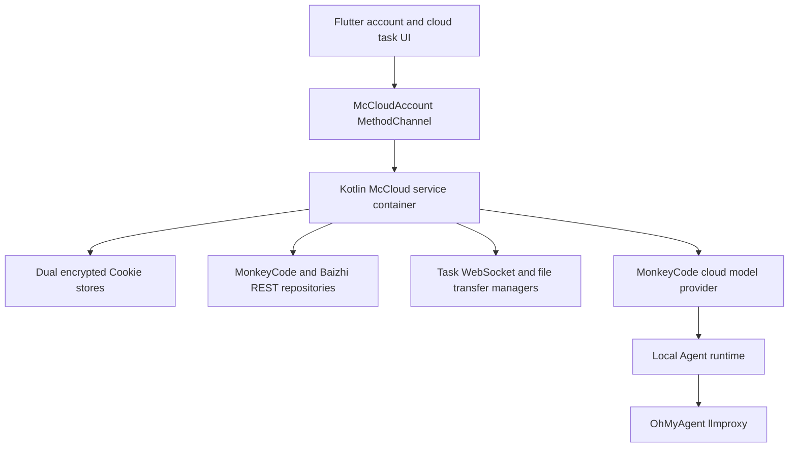

# Architecture

## MonkeyCode Cloud Integration

The Android process owns MonkeyCode Cloud networking and credentials. Flutter only receives sanitized domain payloads through platform channels.

The local Agent runtime, local task state machine, Room database, MCP/plugin tools, and local BYOK profiles remain device-owned. The retired omni-account runtime is no longer initialized or registered as a Flutter channel. A one-time McCloud migration clears its token and platform-mode state while preserving `ModelProviderConfigStore` data.

Cloud model synchronization stores each server model name in the matching Provider profile inventory. The existing model selector reads that inventory directly, so the llmproxy does not need to expose a model-discovery endpoint. Locked profiles remain visible and expose no selectable inventory.

Cloud model requests use the existing OpenAI-compatible transport. The selected cloud profile supplies an encrypted proxy key (`oma_*` on the current backend or legacy `omk-*`) and signing secret. `HttpController` extracts the final request system prompt and adds `X-OhMyAgent-Signature` immediately before sending Chat Completions, Responses, or Anthropic Messages requests. A 401 or 403 response renews the cloud credential and replays the signed request once; BYOK requests bypass this lifecycle.

Cloud task execution remains remote and enters the same ACP session boundary as local Agents. `McCloudAcpSessionAdapter` maps task list/detail/rounds and `new`/`attach` WebSocket frames to `session/list`, `session/load`, `session/prompt`, `session/cancel`, and `session/update`. Flutter opens these sessions with runtime `mccloud`, then reuses `AgentEventReducer` and `ChatConversationRuntimeCoordinator` for the normal chat UI. The Home task sidebar loads recent cloud tasks and refreshes them from cloud lifecycle events.
