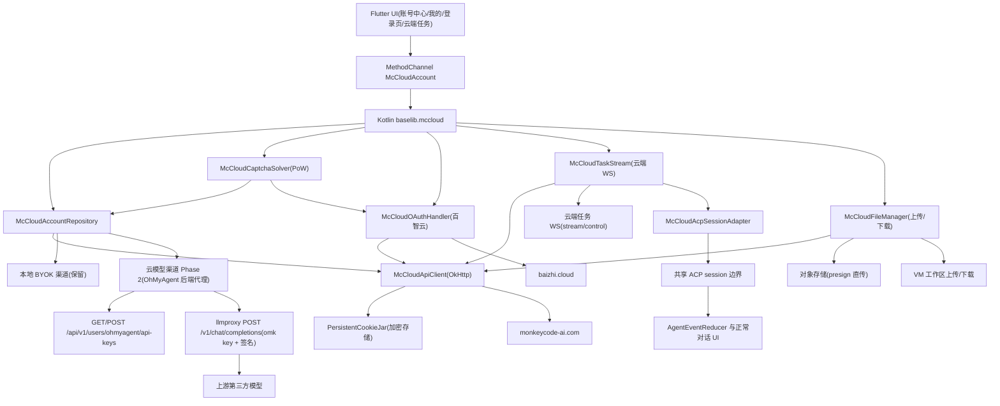
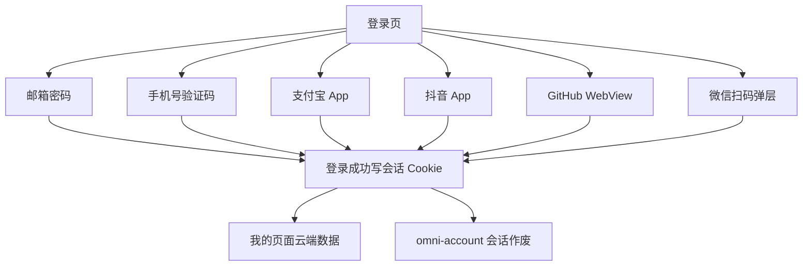

# MonkeyCode 云端集成

Feature Name: monkeycode-cloud-integration
Updated: 2026-08-29

## Description

将 chaitin/MonkeyCode 移动端与桌面端的账户、云端功能迁移进 OmniBot Android 应用。客户端直连 MonkeyCode 官方后端 `https://monkeycode-ai.com` 与百智云 `https://baizhi.cloud`，复用其会话 Cookie、钱包、签到、邀请、订阅、Git 身份、项目任务、自定义模型与云端任务执行能力。

设计决策（已与用户确认）：

1. **替换现有账户体系**：账号中心登录与个人资料数据源从 `omni-account`（`baselib/account` 的 JWT 接口）切换到 MonkeyCode 云；登录方式扩展为邮箱密码、手机号验证码、支付宝、抖音、GitHub、微信扫码六种。
2. **Kotlin 客户端 + MethodChannel**：网络与会话逻辑放 Kotlin `baselib`（OkHttp + 加密 CookieJar），Flutter 经 MethodChannel 桥接，与现有 `account_service.dart` 模式一致。
3. **新增云模型渠道，本地能力全保留**：OmniBot 本地 Agent 运行时（`AgentRuntimeManager`/`AgentOrchestrator`/`OmniAgentExecutor`/`SubagentDispatcher`/`LocalAcpRuntime`）、assists 状态机、Room 数据库与本地 BYOK 全部保留；云端登录后在现有 AI 渠道（platform/byok）之外新增"MonkeyCode 云模型"渠道，作为新 Provider 类型供本地 Agent 调用，现有本地 BYOK 提供商、Key、场景选择保持不变。
4. **官方 AI 渠道退役**：`omni-account` 的 platform 模式（品牌模型网关）随账户体系替换一并退役；登录切换为云后该渠道无 JWT token 来源，其代码路径从 AI 路由中移除。
5. **云模型走后端代理（参考 Windows 桌面版）**：Phase 2 中云自定义模型接入聊天时，复用桌面版已验证的 OhMyAgent 代理闭环——登录后 `POST /api/v1/users/ohmyagent/api-keys` 领取代理凭据 `{id, api_key, signing_secret}`；当前后端生成 `oma_*`，历史环境可能返回 `omk-*`。聊天请求发往后端 llmproxy 端点 `{server}/v1/chat/completions|responses|messages`，`Bearer/X-Api-Key = api_key`，请求头携带 `X-OhMyAgent-Signature: v1=<hex(HMAC-SHA256(signing_secret, system_prompt))>`；后端按 key 解析模型、替换为真实模型名、验签后代理上游并记录用量。客户端不接触第三方模型 `api_key`。该接口为官方支持（桌面版 `mc_ohmyagent_key_create` 对应实现，见 References），无额外前置条件。
6. **存量会话作废**：升级后既有 `omni-account` 登录会话直接作废，用户需用 MonkeyCode 云账号重新登录；本地 BYOK 提供商、Key、场景选择保留。
7. **微信扫码登录（参考 Windows 桌面版）**：复用桌面版已验证的百智云微信 OAuth 协议——`GET /api/v1/user/oauth/login?platform=wechat` 取授权地址 → 解析二维码 uuid → 下发二维码图片 → 以 `lp.<授权页域名>` 基址长轮询 `wx_errcode`（408 待扫码/404 待确认/403 取消/402|500 过期/405 成功）→ 拿 `wx_code` 走百智云回调完成登录。与手机号/支付宝/抖音登录同走百智云 Cookie 罐。本期保持此扫码形态；微信 App 内一键授权（OpenSDK）为已登记的服务端改造项，见"后续改造项"。
8. **云端任务执行（参考 Windows 桌面版）**：云端任务页在列表之外支持创建任务（任务选项接口拉宿主/镜像/CLI/资源默认值 → `POST /api/v1/users/tasks`）、云端 WebSocket 流式跟随执行输出、停止当前轮（`PUT /api/v1/users/tasks/stop`）、删除任务、按游标回放历史轮次与提问索引。WS 拨号端点 `GET /api/v1/users/tasks/stream?id={}&mode=stream|control`（`http`→`wss`），断线指数退避重连封顶 30 秒。
9. **云端任务文件管理（参考 Windows 桌面版）**：附件走预签名直传对象存储；VM 工作区文件支持 multipart 上传与流式下载（目录由服务端打包 zip），下载可取消并清理残件。
10. **云模型目录使用同步清单**：每个 MonkeyCode 云 profile 保存确定的服务端模型名与协议，模型选择器直接读取同步目录；llmproxy 仅承担推理代理，不作为模型发现接口。
11. **云任务接入共享 ACP 会话**：Android `McCloudAcpSessionAdapter` 将任务列表、详情、rounds 和 stream 映射为 `session/list/load/prompt/cancel/update`；Flutter 侧复用 `AgentEventReducer`、`ChatConversationRuntimeCoordinator` 和现有聊天页面。

迁移基于"本项目已有相关代码和功能"：不搬运 React Native 与 Tauri 代码，在 OmniBot 技术栈内重写 MonkeyCode 移动端与桌面端能力。

## Architecture





## Components and Interfaces

### 1. Kotlin 客户端层（baselib 新增包 `cn.com.omnimind.baselib.mccloud`）

| 组件 | 职责 | 关键接口 |
|---|---|---|
| `McCloudEndpoint` | 云端地址常量 | `BASE_URL=https://monkeycode-ai.com`，`BAIZHI_BASE_URL=https://baizhi.cloud`，构建属性可覆盖 |
| `McCloudApiClient` | HTTP 封装、信封解析、401 回调 | `request(path, method, body, query): ApiEnvelope<T>` |
| `PersistentCookieStore` | Cookie 加密持久化 | 复用 Android Keystore 加密的 SharedPreferences/MMKV |
| `McCloudAccountRepository` | 会话与账户业务 | login / logout / deleteAccount / status / bindEmail |
| `McCloudCloudRepository` | 云端业务 | getWallet / checkin / listInvitations / getSubscription |
| `McCloudGitRepository` | Git 身份 | list / add / update / delete / detail / getGitOAuthUrl |
| `McCloudModelRepository` | 云模型 | list（档位锁定 locked / is_hidden 跳过 / owner.type 归类）/ create / update / delete / healthCheck / listProviderModels |
| `McCloudProjectRepository` | 项目任务 | listProjects / listTasks / createProject / getTaskDetail / getTaskCount / createTask / stopTask / deleteTask / getTaskOptions / getTaskRounds / getTaskUserInputs |
| `McCloudTaskStream` | 云端任务 WS 桥 | connect / onEvent / control（停止/继续）/ disconnect；stream 管道流式输出，断线指数退避重连（封顶 30 秒），拨号超时 30 秒 |
| `McCloudFileManager` | 云端文件 | uploadAttachment（presign 直传）/ uploadVmFile（multipart）/ downloadVmFile（流式落盘，目录 zip）/ cancelDownload |
| `McCloudOhmyAgentKeyRepository` | 代理凭据（Phase 2） | createKey（`POST /api/v1/users/ohmyagent/api-keys`）/ deleteKey（`DELETE .../{id}`），omk key 与 signing_secret 加密存储 |
| `McCloudAcpSessionAdapter` | 云任务统一会话适配 | session/list / session/load / session/prompt / session/cancel；rounds 与 task stream 映射为 session/update |
| `McCloudCaptchaSolver` | go-cap PoW 求解 | `solveChallenges(challenge): IntArray`，`obtainCaptchaToken(domain: monkeycode\|baizhi): String`——monkeycode 与 baizhi 为两个独立 captcha 服务（独立 challenge/redeem 端点与独立 Cookie 罐） |
| `McCloudOAuthHandler` | 百智云 OAuth | sendPhoneCode / loginPhone / prepareAlipayAppLogin / loginAlipayApp / loginDouyinApp / getGitHubLoginUrl / startWechatLogin（二维码会话 + 长轮询）/ completePhoneBind |
| `McCloudSessionManager` | 登录态门面 | `isSignedIn` / `currentUser` / `clearSession` / 401 回调注册 |

`McCloudApiClient` 使用 OkHttp `CookieJar` 自动管理 `monkeycode_ai_session`。Cookie 序列化写入加密存储，进程重启后恢复。所有接口返回统一信封 `{ code, message, data }`，`code != 0` 抛 `McCloudApiException`。

### 2. MethodChannel 桥接（app 模块）

| 通道 | 方法组 | 说明 |
|---|---|---|
| `cn.com.omnimind.bot/McCloudAccount` | `loginWithPassword` / `loginWithPhone` / `loginWithAlipayApp` / `loginWithDouyinApp` / `loginWithGithub` / `startWechatLogin`（返回二维码 data URL + 轮询流）/ `cancelWechatLogin` / `sendPhoneCode` / `logout` / `deleteAccount` / `getSessionState` | 账户与登录 |
| 同上 | `getWallet` / `getCheckinStatus` / `submitCheckin` / `listInvitations` / `getSubscription` / `bindEmail` | 云端业务 |
| 同上 | `listGitIdentities` / `addGitIdentity` / `updateGitIdentity` / `deleteGitIdentity` | Git 身份 |
| 同上 | `listModels` / `createModel` / `updateModel` / `deleteModel` / `checkModelConfig` / `listProviderModels` | 云模型（含 locked/is_hidden 标记） |
| 同上 | `listProjects` / `listTasks` / `createProject` / `getTaskDetail` / `createTask` / `stopTask` / `deleteTask` / `getTaskOptions` / `getTaskRounds` / `getTaskUserInputs` | 项目任务 |
| 同上 | `openTaskStream` / `closeTaskStream` / `taskStreamEventStream`（事件通道）/ `uploadAttachment` / `uploadVmFile` / `downloadVmFile` | 云端任务流与文件 |

实现位于 `app/src/main/java/cn/com/omnimind/bot/ui/channel/McCloudAccountChannel.kt`，与现有 `AccountChannel` 并列。

### 3. Flutter UI（ui/lib）

| 页面/服务 | 路径 | 说明 |
|---|---|---|
| `mc_cloud_service.dart` | `ui/lib/services/` | MethodChannel 客户端，镜像 Kotlin 方法 |
| `mc_cloud_login_page.dart` | `ui/lib/features/my/pages/account/` | 六种登录视图（密码/手机/Web OAuth/微信扫码弹层）+ 服务地址设置 |
| `mc_cloud_profile_page.dart` | 同上 | 身份卡、积分、签到、邀请、会员、今日额度、退出 |
| `mc_cloud_git_identities_page.dart` | 同上 | Git 身份列表与手动绑定表单 |
| `mc_cloud_models_page.dart` | 同上 | 云模型列表（档位锁定置灰）、新建/编辑自有模型、健康检查 |
| `mc_cloud_projects_page.dart` | 同上 | 项目与任务列表 |
| `mc_cloud_task_detail_page.dart` | 同上 | 云端任务执行：创建表单（宿主/镜像/CLI/资源选项）、流式输出跟随、停止/删除、轮次回放、提问索引 |
| `mc_cloud_task_files_sheet.dart` | 同上 | VM 工作区文件上传/下载、附件直传、进度与取消 |
| Home 任务侧边栏 | `ui/lib/features/home/widgets/` | 展示云任务状态并打开 `agentRuntime=mccloud` 的会话目标 |
| 共享聊天页 | `ui/lib/features/home/pages/chat/` | 通过 Agent runtime 加载云任务并复用正常消息、工具与状态 UI |
| 路由注册 | `ui/lib/features/my/router_config.dart` | 新增上述路由 |

### 4. 与现有账户体系的关系

- **账号中心替换**：`account_auth_page.dart`、`account_page.dart` 的登录与资料展示切换为 MonkeyCode 云数据源；`omni-account` 的 `/v1/auth/*`、`/v1/me*` 调用从 UI 流程中移除。
- **存量会话作废**：升级后首次启动检测到旧 `omni-account` 会话时，直接清除 Token 与 AI 模式存储；本地 BYOK Provider、Key、场景选择保留。
- **官方 AI 渠道退役**：`AiRequestAccessResolver` 的 platform 分支、`AiRequestTransportPolicy` 的 `PLATFORM_ROUTE_TAG` 转发、`PlatformAiProvisioner`、`OmniOfficialProvider`、`PlatformModelApiClient`、`PlatformMediaGateway` 依赖 `omni-account` JWT 的路径随替换移除或改为短路；AI 渠道收敛为本地 BYOK + 云模型（Phase 2）。
- **云模型渠道（Phase 2，参考 Windows 桌面版）**：云端登录后新增 Provider 类型。接入流程：登录 → `mc_ohmyagent_key_create` 领取 omk key + signing_secret → `GET /api/v1/users/models?limit=200` 同步模型清单 → 聊天请求经 `{server}/v1/chat/completions|responses|messages` 走 llmproxy 代理，`X-Api-Key`/`Bearer` 携带 omk key，请求头 `X-OhMyAgent-Signature: v1=<hex(HMAC-SHA256(signing_secret, system_prompt))>`，请求体 `model` 字段传服务端模型名。退出/断开时 `DELETE /api/v1/users/ohmyagent/api-keys/{id}` 吊销凭据。共享模型（`owner.type` 非 private）可选用但超档（locked）置灰；客户端不接触第三方模型 `api_key`。
- **本地 Agent 用云模型（Phase 2）**：云端 Provider 复用现有 `AiTransportRoute` 机制（`protocolType=openai_compatible`、`wireApi=chat_completions`），由 `AgentLlmClient` 以 OpenAI 兼容协议请求 `{server}/v1/chat/completions`（llmproxy），携带 omk key 与签名头——与 Windows 版"本地引擎 → llmproxy"链路同构。差异仅在：Windows 版把云模型物化到引擎配置文件，OmniBot 以 Provider 类型动态生成路由。本地 Agent 运行时与本地 BYOK 不因云模型引入而改变。
- **微信扫码登录（Phase 1，参考桌面版 `wechat.rs`）**：与手机号/支付宝/抖音同走百智云 Cookie 罐。流程：`GET /api/v1/user/oauth/login?platform=wechat&redirect_url={account}/` 取授权地址 → 从授权页 HTML 解析 `/connect/qrcode/<uuid>` → 拉取二维码图片（data URL 下发 Flutter 弹层展示）→ 以 `lp.<授权页域名>` 为基址长轮询 `wx_errcode`/`wx_code`（Service 同一时刻只保留最新一次扫码会话）→ 405 成功后请求百智云回调落 Cookie。取消/过期（403/402|500）关闭弹层。
- **云端任务执行（Phase 3，参考桌面版 `cloudapi.ts`/`useCloudTask.ts`）**：任务详情页云端视图。创建任务前拉取任务选项（宿主/镜像/CLI/资源），`POST /api/v1/users/tasks` 提交后打开云端 WS（stream 管道）流式输出；拨号失败/断线按指数退避重连（封顶 30 秒），收到结束帧停止重连；control 管道下发停止；`PUT /api/v1/users/tasks/stop` 仅中断当前轮，`DELETE /api/v1/users/tasks/{id}` 删除任务；切换查看时按游标回放历史轮次与提问索引。
- **云端任务文件（Phase 3，参考桌面版 `uploads.rs`）**：附件先经预签名地址直传对象存储，再把返回地址放入消息附件；VM 工作区文件 multipart 上传至 VM 绝对路径；下载流式落盘（目录由服务端打包 zip），支持取消并清理残件，进度经事件通道上报。
- **云模型目录接线**：`MonkeyCodeCloudModelProjection.modelId` 进入 Provider 模型目录缓存；`fetchProviderModels` 对 `sourceType=monkeycode` 返回同步模型，避免请求 llmproxy `/models`。场景绑定和会话级模型覆盖均携带 `providerProfileId`，使 `HttpController` 能识别云路由并动态签名。
- **云任务 ACP 适配**：任务 ID 作为 opaque `agentSessionId`，runtime 标识为 `mccloud`。adapter 将 REST rounds 和 WebSocket frame 规范化为 ACP `session/update`，并通过既有 `AgentRuntimeManager.emitEvent()` 发布，Flutter 侧不新增第二套 reducer。

### 5. 阶段划分

| 阶段 | 内容 | 验收 |
|---|---|---|
| Phase 1 | Kotlin `mccloud` 客户端层、PoW 求解器、百智云 OAuth（含微信扫码）、MethodChannel、账号中心替换、我的页面云端功能、Git 身份、云模型管理（含档位锁定）、项目任务列表、存量会话作废、官方 AI 渠道退役 | 六种登录可用（含微信扫码）；我的页面展示积分/签到/邀请/会员/额度；Git/模型/项目管理可用；BYOK 渠道不受影响 |
| Phase 2 | 云模型聊天接入（参考 Windows 桌面版）：领取 omk key + signing_secret，同步模型清单，新增 Provider 类型，聊天请求经 llmproxy（`/v1/chat/completions|responses|messages`）代理，实现 OhMyAgent 签名；退出吊销 key；共享模型与超档模型置灰 | 本地 Agent 可选用云模型执行任务（文本模型，本地执行 + 云端代理）；流式输出正常；第三方模型凭据不落客户端；断开后 key 吊销 |
| Phase 3 | 云端任务执行（参考桌面版）：任务选项、创建任务、云端 WS 流式跟随与控制、停止/删除、轮次回放、提问索引；VM 工作区文件上传/下载、附件 presign 直传、进度与取消 | 可创建云端任务并流式跟看输出；停止仅中断当前轮；断线自动重连；文件可上传/下载且取消后无残件 |

### 6. 后续改造项（已登记）

| 项 | 现状 | 触发条件 | 涉及面 |
|---|---|---|---|
| 微信 App 内一键授权（OpenSDK） | 百智云 `platform=wechat` 仅暴露 qrconnect 网页扫码协议，无 App OAuth 渠道 | 服务端新增微信 App 登录渠道（微信开放平台移动应用 AppID/AppSecret、openid/unionid 绑定）后，客户端集成 WeChat OpenSDK 唤起微信授权 | 服务端（百智云/MonkeyCode）+ 微信开放平台应用资质 + Android 端集成 OpenSDK；本期不实施 |

## Data Models

```
McCloudApiEnvelope<T> { code: Int; message: String?; data: T? }
McCloudUser { id, name, username, email, avatarUrl, role, team? }
McCloudWallet { balance: Long, dailyTokenBalance, dailyTokenLimit }
McCloudSubscription { plan, expiresAt, autoRenew, source }
McCloudInvitation { id, name, avatarUrl, credits, invitedAt }
McCloudModel { id, model, remark, provider, isDefault, isFree, isHidden, locked,
               baseUrl?, apiKey?, interfaceType, contextLimit, outputLimit,
               thinkingEnabled, supportImage }
McCloudGitIdentity { id, platform, baseUrl, username, email, accessToken,
                    remark, organizationId, isInstallationApp, createdAt,
                    authorizedRepositories }
McCloudProject { id, name, description, repoUrl, platform, createdAt, tasks }
McCloudTask { id, title, content, status, type, model?, stats?, createdAt,
              rounds?, options? }
McCloudTaskOption { hostTypes, images, clis, resources }  // 宿主/镜像/CLI/资源默认值
McCloudTaskRound { round, startAt, endAt, summary, events }
McCloudTaskUserInput { round, question, answer, answeredAt }
McCloudTaskFile { path, size, isDir, round? }
McCloudWechatSession { uuid, state, callbackUrl, lpBase, qrDataUrl, errcode, wxCode }
McCloudOhmyAgentKey { id, apiKey("oma_*" or legacy "omk-*"), signingSecret, server, baseUrl }
```

字段命名与后端 JSON（camelCase）一致；Kotlin 用 Gson 序列化，与现有 `AccountApiClient` 风格统一。

## Correctness Properties

1. **会话完整性**：登录成功后 Cookie 必须持久化；应用重启后 `getSessionState` 必须恢复登录态。
2. **401 一致性**：任意云接口返回 401，必须清除本地会话并触发统一"重新登录"回调，只处理一次。
3. **验证码并发**：同一时刻全局仅允许一个 PoW 求解任务（跨 monkeycode/baizhi 两域），避免签到与登录并发重复求解。
4. **替换不破坏本地 BYOK**：云端登录与存量会话作废不得改写本地 BYOK Provider、Key 或场景选择。
5. **官方渠道退役无残留**：旧 `omni-account` 会话清除后，不得再触发平台网关请求；AI 路由只保留 BYOK（Phase 1）与云模型（Phase 2）。
6. **代理凭据隔离**：omk key 与 signing_secret 写入本地加密存储，日志脱敏；聊天请求仅经 llmproxy 代理，客户端不接收、不存储第三方模型 `api_key`。签名使用 `X-OhMyAgent-Signature: v1=<hex(HMAC-SHA256(secret, system_prompt))>`，system_prompt 提取规则与后端 `ValidateOhMyAgentPrompt` 对齐（system 字段 → instructions → messages 首个 system → input 首个 developer/system）。
7. **敏感字段保护**：云模型 `apiKey`、Git 身份 `accessToken`、omk key、signing_secret 写入本地加密存储，日志中脱敏。
8. **WS 生命周期**：任务流拨号失败/断线按指数退避重连（封顶 30 秒）；收到结束帧或用户退出后停止重连并释放连接；同一任务同一时刻仅允许一个活跃连接。
9. **微信单会话**：`McCloudOAuthHandler` 同一时刻只保留最新一次微信扫码会话；弹层取消、过期（402|500）或成功（405）即清空会话，防状态串扰。
10. **文件下载原子性**：下载中断或取消必须清理残件，不允许半文件留存；上传/下载取消后事件通道停止进度上报。
11. **用量聚合容错**：我的页面用量（钱包/订阅/签到/邀请）四路并发拉取，部分失败以空占位展示，仅全失败才报错，不因单一路径失败阻塞整个面板。
12. **云模型目录完整性**：每个可选云 profile 必须暴露且仅暴露一个确定的服务端模型名；locked profile 不得进入可选集合。
13. **云任务身份隔离**：云任务事件必须携带稳定 `sessionId`、`turnId`、`messageId` 或 `toolCallId`，并由共享 coordinator 按任务会话隔离。

## Error Handling

| 场景 | 处理 |
|---|---|
| 网络错误 | 抛出 `McCloudApiException`，UI 展示"网络错误"并保留当前页面状态 |
| 业务错误（code != 0） | 展示服务端 `message`（去除 `[trace_id]` 后缀） |
| 401 | 清除会话，跳转登录页，提示"登录已过期，请重新登录" |
| PoW 求解失败/超时 | 提示"验证码计算超时，请重试"，允许用户重试 |
| Git 身份被项目占用删除（409） | 展示后端冲突信息 |
| 支付宝 App 未安装 | 提示安装或引导切换其他登录渠道 |
| 微信授权页/二维码解析失败 | 提示"微信登录失败"，允许重试或切换其他渠道 |
| 微信扫码超时/过期（402/500） | 关闭弹层并提示"二维码已过期，请重新发起" |
| 任务 WS 拨号/断线 | 指数退避重连（封顶 30 秒），超上限提示"云端连接中断"；收到结束帧停止重连 |
| 任务停止/删除冲突 | 展示后端返回的当前状态，按状态刷新列表 |
| 文件上传/下载失败 | 清理残件，事件通道上报失败与进度归零 |
| 注销失败 | 展示错误并保留当前登录（仅服务端确认成功后才清除本地会话） |
| Phase 2 代理返回 401/403 | 会话失效则清除会话回登录页；omk key 失效则重新领取；模型不可达展示上游错误 |
| Phase 2 签名校验失败 | 检查 system_prompt 提取与 HMAC 计算一致性，提示"模型请求校验失败" |
| 云模型目录为空 | 重新同步 MonkeyCode 模型目录并展示同步错误；保留本地 BYOK 模型目录 |
| 云任务历史加载失败 | 保留已加载消息并展示重试入口 |
| 云任务实时流中断 | 按 bounded backoff 重新 attach，使用序号去重回放帧 |

## Test Strategy

| 层 | 测试 | 工具 |
|---|---|---|
| PoW 求解器 | 用 go-cap 协议向量做黄金用例（固定 challenge 的 nonce 结果） | JUnit |
| OhMyAgent 签名 | 用固定 signing_secret + system_prompt 的 HMAC-SHA256 十六进制向量做黄金用例 | JUnit |
| API 客户端 | MockWebServer 模拟信封、401、网络错误、Cookie 持久化 | JUnit + OkHttp MockWebServer |
| 仓库层 | Repository 单测：登录写会话、401 刷新、注销清理 | JUnit + Fake Remote |
| 云端任务流 | MockWebServer（WS）+ 脚本化事件：流式输出、结束帧、断线重连、拨号超时 | JUnit + OkHttp WebSocket Mock |
| 微信登录 | 授权页 fixture + 长轮询脚本化 wx_errcode 序列（408→405/403/402） | JUnit + MockWebServer |
| 文件管理 | 下载流写入与取消清理、上传进度 | JUnit + TempDir |
| Flutter | 登录表单校验、签到按钮状态、邀请链接复制、任务流 UI 状态 | flutter_test |
| 云模型目录 | 同步 projection 进入模型选择目录、locked 过滤、会话覆盖保留 Provider 身份 | JUnit + flutter_test |
| 云任务 ACP | session list/load/prompt/cancel、rounds/frame 映射、任务间身份隔离 | JUnit |
| 任务侧边栏 | 云任务分组、状态、点击路由、会话过期清理 | flutter_test |
| 集成 | `assembleDevelopStandardDebug` 构建验证 | Gradle |

## References

[^1]: (代码) - [MonkeyCode mobile client.ts](/tmp/opencode/MonkeyCode-main/mobile/src/api/client.ts)
[^2]: (代码) - [MonkeyCode mobile baizhi.ts](/tmp/opencode/MonkeyCode-main/mobile/src/api/baizhi.ts)
[^3]: (代码) - [MonkeyCode mobile captcha.ts](/tmp/opencode/MonkeyCode-main/mobile/src/api/captcha.ts)
[^4]: (代码) - [MonkeyCode mobile profile.tsx](/tmp/opencode/MonkeyCode-main/mobile/app/(tabs)/profile.tsx)
[^5]: (代码) - [MonkeyCode mobile login.tsx](/tmp/opencode/MonkeyCode-main/mobile/app/login.tsx)
[^6]: (代码) - [MonkeyCode mobile AuthContext.tsx](/tmp/opencode/MonkeyCode-main/mobile/src/auth/AuthContext.tsx)
[^7]: (代码) - [OmniBot account client](/workspace/baselib/src/main/java/cn/com/omnimind/baselib/account/)
[^8]: (文档) - [OmniBot 账号客户端说明](/workspace/docs/account-client.zh-CN.md)
[^9]: (代码) - [MonkeyCode backend llmproxy register.go](/tmp/opencode/MonkeyCode-main/backend/biz/llmproxy/register.go)
[^10]: (代码) - [MonkeyCode backend llmproxy proxy.go](/tmp/opencode/MonkeyCode-main/backend/biz/llmproxy/proxy.go)
[^11]: (代码) - [MonkeyCode backend llmproxy ohmyagent_prompt.go](/tmp/opencode/MonkeyCode-main/backend/biz/llmproxy/ohmyagent_prompt.go)
[^12]: (代码) - [MonkeyCode desktop baizhi monkeycode.rs（mc_ohmyagent_key_create / mc_models_sync / mc_usage）](/tmp/opencode/MonkeyCode-main/desktop/src/baizhi/monkeycode.rs)
[^13]: (代码) - [MonkeyCode desktop config.rs（monkeycode 条目物化）](/tmp/opencode/MonkeyCode-main/desktop/src/config.rs)
[^14]: (代码) - [MonkeyCode desktop baizhi mod.rs（OHMYAGENT_KEY_FILE / resolve_mc_llm / Endpoints）](/tmp/opencode/MonkeyCode-main/desktop/src/baizhi/mod.rs)
[^15]: (代码) - [MonkeyCode desktop baizhi wechat.rs（微信扫码登录）](/tmp/opencode/MonkeyCode-main/desktop/src/baizhi/wechat.rs)
[^16]: (代码) - [MonkeyCode desktop baizhi sync.rs（ai-models 模型网关同步）](/tmp/opencode/MonkeyCode-main/desktop/src/baizhi/sync.rs)
[^17]: (代码) - [MonkeyCode desktop ui cloudapi.ts（云端任务/文件 IPC 命令）](/tmp/opencode/MonkeyCode-main/desktop/ui/src/cloudapi.ts)
[^18]: (代码) - [MonkeyCode desktop ui useCloudTask.ts / cloudtask.tsx（云端任务流式跟随）](/tmp/opencode/MonkeyCode-main/desktop/ui/src/useCloudTask.ts)
[^19]: (代码) - [MonkeyCode desktop ui newtask.tsx（任务创建与选项）](/tmp/opencode/MonkeyCode-main/desktop/ui/src/newtask.tsx)
[^20]: (代码) - [MonkeyCode desktop src/uploads.rs（附件直传 / VM 文件流）](/tmp/opencode/MonkeyCode-main/desktop/src/uploads.rs)
[^21]: (代码) - [MonkeyCode backend biz/task（云端任务接口与 WS 管道）](/tmp/opencode/MonkeyCode-main/backend/biz/task)
